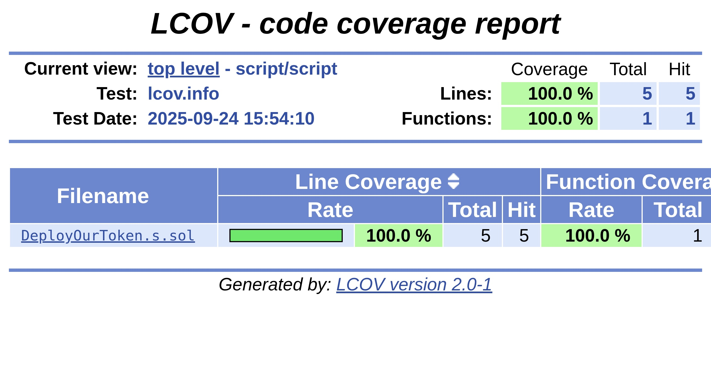

---

# 🪙 ERC20 Token — Foundry (Sepolia Verified)

**Solidity License:** MIT

This repository is my practical implementation of an ERC20 token based on Cyfrin Updraft (Instructor: Patrick Collins), with my own additions: full test suite, coverage, deployment and verification on Sepolia, reproducible artifacts in `broadcast/`, and a README with reproduction steps.

---

## Table of Contents
- [🪙 ERC20 Token — Foundry (Sepolia Verified)](#-erc20-token--foundry-sepolia-verified)
  - [Table of Contents](#table-of-contents)
  - [Overview](#overview)
  - [Tech Stack](#tech-stack)
  - [Contracts](#contracts)
  - [Deployment Proof (Sepolia)](#deployment-proof-sepolia)
  - [Getting Started](#getting-started)
    - [Requirements](#requirements)
    - [Quickstart](#quickstart)
    - [Environment Variables](#environment-variables)
  - [Local Development (Anvil)](#local-development-anvil)
  - [Testing \& Coverage](#testing--coverage)
      - [Coverage screenshots](#coverage-screenshots)
    - [Gas Reports](#gas-reports)
  - [Deployments](#deployments)
    - [Deploy to Sepolia](#deploy-to-sepolia)
    - [Manual Verification](#manual-verification)
  - [Interaction (cast)](#interaction-cast)
  - [Reproducibility (broadcast)](#reproducibility-broadcast)
  - [Notes on `ManualToken`](#notes-on-manualtoken)
  - [Formatting](#formatting)
  - [Docs \& Screenshots](#docs--screenshots)
  - [Credits](#credits)
  - [Contact](#contact)
  - [License](#license)

---

## Overview
Goal: a clean, minimal ERC20 using OpenZeppelin with a full CI-oriented lifecycle—local development, tests, coverage, gas reports, testnet deployment, Etherscan verification, and documentation.

- **Primary token:** `OurToken` (OpenZeppelin ERC20)
- **Additional educational contract:** `ManualToken` (manual ERC20-style implementation for demonstration; covered by tests)

---

## Tech Stack
- **Solidity:** 0.8.30 (EVM: london, optimizer: 200 runs)
- **Foundry:** forge, cast, anvil
- **OpenZeppelin Contracts**
- **Etherscan Verify**
- **LCOV coverage (optional)**

---

## Contracts
- `src/OurToken.sol` — minimal ERC20 based on OpenZeppelin.  
  The constructor mints the entire `initialSupply` to the deployer.
- `src/ManualToken.sol` — educational token “by hand” with approve/transfer/burn/approveAndCall; covered by a separate test suite to demonstrate low-level invariants.

---

## Deployment Proof (Sepolia)

**Network:** Sepolia (chainId `11155111`)  
**Compiler:** `0.8.30` • **EVM:** `london` • **Optimizer:** enabled, runs `200`

- **Contract:** `OurToken`
- **Address:** `0x98efCe50e393315a4aC187494E6d84Bd82B811c9`  
  ↳ Etherscan: https://sepolia.etherscan.io/address/0x98efce50e393315a4ac187494e6d84bd82b811c9
- **Deploy Tx:** `0xd40c121715cfc1744fbdb0e3a512ba916c31b38ef51d6f9cd776a790a1a49983`  
  ↳ Etherscan: https://sepolia.etherscan.io/tx/0xd40c121715cfc1744fbdb0e3a512ba916c31b38ef51d6f9cd776a790a1a49983
- **Deployer:** `0xF6d3a3104b75b0BD2498856C1283e7120c315AeC`  
  ↳ Etherscan: https://sepolia.etherscan.io/address/0xF6d3a3104b75b0BD2498856C1283e7120c315AeC
- **Verified:** ✅ yes
- **Constructor args (hex):**  
  `0x00000000000000000000000000000000000000000000d3c21bcecceda1000000`
- **State checks:**
  - `name` → `OurToken`
  - `symbol` → `OT`
  - `totalSupply` → `1_000_000 * 1e18`
  - `balanceOf(deployer)` → `totalSupply`

> Full metadata is also stored in `DEPLOY.md` and `DEPLOY.json`.

---

## Getting Started

### Requirements
- `git`
- `foundry` (forge, cast, anvil)
- (optional) `make`, `jq`, `lcov` (for HTML coverage)

Verify:
```bash
git --version
forge --version
````

### Quickstart

```bash
git clone <this-repo>
cd <this-repo>
forge install
forge build
```

### Environment Variables

Create a `.env` in the project root (do not commit):

```
SEPOLIA_RPC_URL=YOUR_ALCHEMY_OR_INFURA_URL
PRIVATE_KEY=0xYOUR_TEST_PRIVATE_KEY
ETHERSCAN_API_KEY=YOUR_ETHERSCAN_KEY
```

---

## Local Development (Anvil)

```bash
make anvil
# in another terminal:
make deploy
```

---

## Testing & Coverage

```bash
forge test          # all tests
forge coverage      # console coverage
# HTML coverage:
forge coverage --report lcov
genhtml lcov.info -o coverage-html
xdg-open coverage-html/index.html
```
#### Coverage screenshots

Top-level summary  


Source files (src)  


Scripts (script)  


Tests (test)  


**What’s covered:**

* `test/OurTokenTest.t.sol` — initial properties, allowance, transfer/transferFrom.
* `test/ManualTokenHarness.t.sol` — constructor, transfer, transferFrom, approve/approveAndCall, burn, burnFrom, edge cases.

**Results from my run:**

* `src/OurToken.sol` — 100% lines, 100% funcs
* `src/ManualToken.sol` — 100% lines, 100% funcs, 80% branches
* `script/DeployOurToken.s.sol` — 100%
* Overall: 100% lines, 100% funcs

### Gas Reports

```bash
forge test --gas-report
forge snapshot      # writes .gas-snapshot
```

---

## Deployments

### Deploy to Sepolia

The OurToken script is ready:

```bash
forge script script/DeployOurToken.s.sol:DeployOurToken \
  --rpc-url $SEPOLIA_RPC_URL \
  --private-key $PRIVATE_KEY \
  --etherscan-api-key $ETHERSCAN_API_KEY \
  --broadcast \
  --verify \
  --skip-simulation \
  -vv
```

### Manual Verification

If auto-verify is “Pending”, you can re-run:

```bash
ADDR=<deployed_address>
ARGS=0x00000000000000000000000000000000000000000000d3c21bcecceda1000000

forge verify-contract \
  --chain-id 11155111 \
  --etherscan-api-key $ETHERSCAN_API_KEY \
  --num-of-optimizations 200 \
  --compiler-version v0.8.30 \
  --watch \
  $ADDR src/OurToken.sol:OurToken \
  --constructor-args $ARGS
```

Or manually:

```bash
forge flatten src/OurToken.sol > flat.sol
# Verify & Publish on Etherscan with compiler 0.8.30, EVM london, optimizer on (200), constructor args = $ARGS
```

---

## Interaction (cast)

```bash
ADDR=0x98efCe50e393315a4aC187494E6d84Bd82B811c9

# Reads
cast call $ADDR "name()(string)"         --rpc-url $SEPOLIA_RPC_URL
cast call $ADDR "symbol()(string)"       --rpc-url $SEPOLIA_RPC_URL
cast call $ADDR "totalSupply()(uint256)" --rpc-url $SEPOLIA_RPC_URL

# Balances
OWNER=0xF6d3a3104b75b0BD2498856C1283e7120c315AeC
cast call $ADDR "balanceOf(address)(uint256)" $OWNER --rpc-url $SEPOLIA_RPC_URL

# Transfer 1 wei token to another address
TO=<your_other_address_0x...>
cast send $ADDR "transfer(address,uint256)" $TO 1 \
  --rpc-url $SEPOLIA_RPC_URL \
  --private-key $PRIVATE_KEY
```

---

## Reproducibility (broadcast)

Foundry stores on-chain execution artifacts:

```
broadcast/DeployOurToken.s.sol/11155111/run-latest.json
```

You can extract the deploy hash like this:

```bash
jq -r '.transactions[] | select(.transactionType=="CREATE") | .hash' \
  broadcast/DeployOurToken.s.sol/11155111/run-latest.json
```

---

## Notes on `ManualToken`

`ManualToken` is an educational contract that reimplements basic ERC20 mechanics manually:

* `_transfer` with simple checks;
* `approve`, `transfer`, `transferFrom`, `burn`, `burnFrom`;
* `approveAndCall` with `receiveApproval` callback.

For portfolio purposes I kept a full test suite in `test/ManualTokenHarness.t.sol` and achieved 100% lines/functions coverage.
**Note:** In production, prefer OpenZeppelin ERC20.

---

## Formatting

```bash
forge fmt
```

---

## Docs & Screenshots

* Folders `docs/` and `images/` will contain screenshots of:

  * Etherscan verification,
  * tests and coverage,
  * gas reports.
* I will add links here after uploading the artifacts.

---

## Credits

* Course: **Cyfrin Updraft — Foundry Fundamentals**
* Instructor: **Patrick Collins**
* Implementation, tests, deployment, documentation: **Volodymyr Stetsenko**

---

## Contact

* X (Twitter): [https://x.com/carstetsen](https://x.com/carstetsen)
* Telegram: [https://t.me/Zero2Auditor](https://t.me/Zero2Auditor)
* LinkedIn: [https://www.linkedin.com/in/volodymyr-stetsenko-656014246/](https://www.linkedin.com/in/volodymyr-stetsenko-656014246/)

---

## License

MIT — see `LICENSE`.

---
